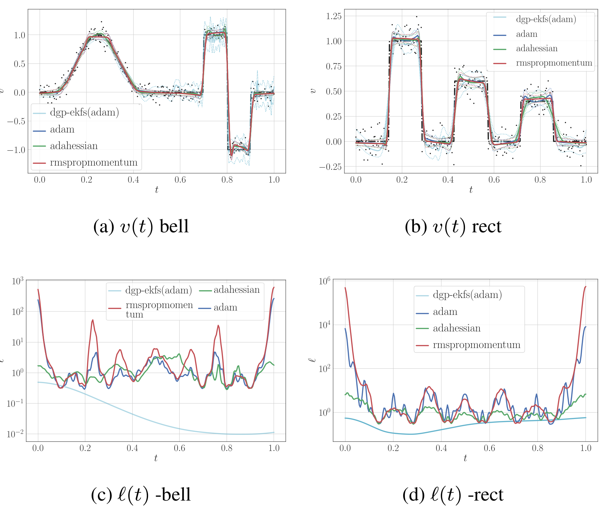
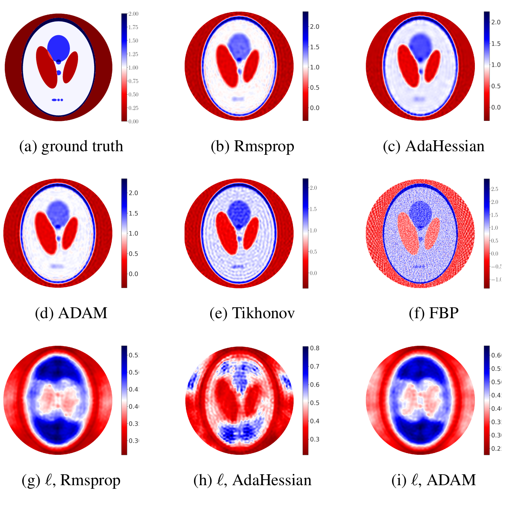

# DeepGalerkinSPDE
Deep Gaussian processes based on the stochastic partial differential equations (SPDE)  form, implemented in Jax. 
This repository contains codes from the paper:
"Fast optimize-and-sample method for differentiable Galerkin approximations of multi-layered Gaussian process priors"



*Realization no 49 of the estimation results for signals described in 
(10a) and (10b) respectively. In 1a and 1b, the ground truth is the black dash-dotted line, 
the mean estimates are the solid lines, and the two standard deviation confidence interval are given by the dotted lines 
of each color.*


*Comparison of reconstruction results using MGP with Rmsprop, AdaHessian, and ADAM, their length respective scales, and the reconstruction result using 
Tikhonov regularization ($\lambda=7.50\times 10^{-3} \left\lVert H/\sigma_r \right\rVert$, where $\sigma_r$ is the measurement noise standard deviation, $\left\lVert\cdot\right\rVert$ is matrix norm) 
and filtered back projection.*

What is it?
-----------
This code performs an optimization of multi-layers Gaussian processes hyper-prior layers in a one dimensional regression and X-ray tomography problem using JaX.
For comparison, we also include Matlab codes that do the optimization of multi-layers Gaussian processes for one dimensional regression problem, which is 
written based on the paper "Deep State-Space Gaussian Processes" Statistics and Computing, 2021.


Abstract of the paper
---------------------

Multi-layered Gaussian process (field) priors are non-Gaussian priors which offer a capability to handle Bayesian inference on both smooth and discontinuous functions. Previously, performing Bayesian inference using these priors required constructing a Markov chain Monte Carlo sampler. This sampling technique is very time-consuming to converge and hence the utility of the approach has only been demonstrated for small canonical test problems. In numerous Bayesian inference applications, such as Bayesian inverse problems, the uncertainty quantification of the hyper-prior layers is of less interest, since the main concern is to quantify the randomness of the process/field of interest.

  Therefore, in this article, we propose an alternative approach, where we optimize the hyper-prior layers, while inference is performed only for the lowest layer. Specifically, we use the Galerkin approximation with automatic differentiation to accelerate optimization. We validate the proposed approach against several existing non-stationary Gaussian process methods and demonstrate that it can significantly decrease the execution time, while maintaining comparable accuracy. We also apply the method to an X-ray tomography inverse problem.
  
How to run the simulation?
--------------------------
## one dimensional (JaX)
```
python ./Examples/optimize_denoising_one_D.py
```

## one dimensional (MATLAB)
See, `README.md` in the folder `./Matlab`.

## Xray (JaX)
```
python ./Examples/Sinogram_example.py --help
e.g.
python ./Examples/Sinogram_Example.py --optimizer=rmspropmomentum --learn=2e-2 --momentum=0.9 --steps=4000 --var=0.0001 --basis=32 --target-basis=128 --ntheta=45 --learn-sigma --capture=10 --upscale 4
```


